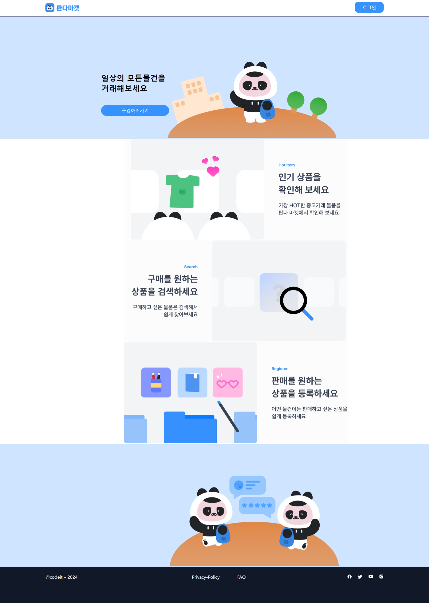
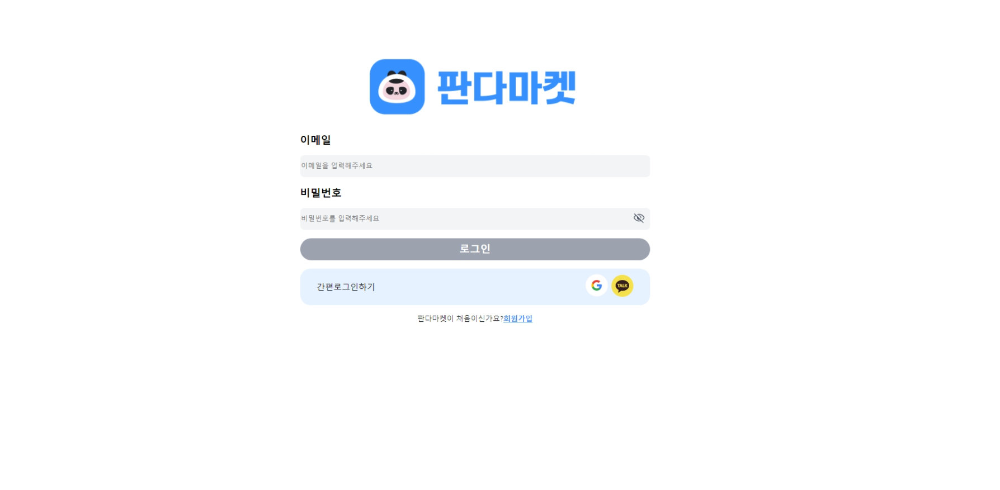
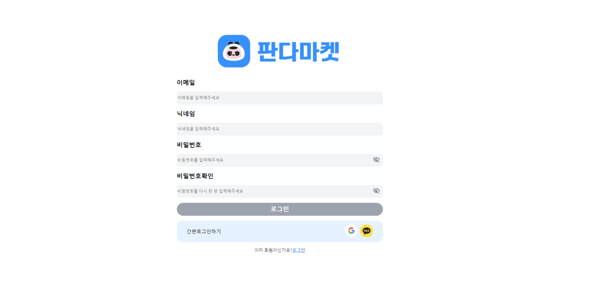

# 요구사항

## 기본(동작:✅ 미동작:❌)
```
🕒 기본동작
    [✅] title은 "판다마켓"으로 설정합니다.
    [✅] "판다마켓" 로고 클릭 시 ("/") 페이지로 이동합니다. 
    [✅] "로그인" 버튼 클릭시 "/login" 페이지로 이동합니다.
    [✅] "구경하러가기" 버튼 클릭시 "/items" 페이지로 이동합니다.
    [✅] "회원가입" 버튼 클릭시 "/signup" 페이지로 이동합니다.
    [✅] "판다마켓" 로고와 "로그인" 버튼은 상단바에 고정해주세요.
    [✅]  SNS아이콘 클릭시 해당 사이트로 이동합니다.
    [✅]  input요소에 focus in일때 테두리 색상은 #3692FF 입니다.

🕒 가로너비가 1920 Pixel 보다 작을때
    [✅] "판다마켓" 로고와 "로그인" 버튼의 여백은 200 Pixel로 설정합니다.
    [✅]  화면이 작아질수록 위의 두 요소간 거리가 가까워지도록 설정합니다.
    [✅] "codeit-2024" 와 "SNS아이콘" 의 여백은 200 Pixel을 유지합니다.
    [✅] "Privacy Policy" 와 "FAQ" 는 동일한 간격을 유지하며 가까워져야 합니다.

🕓가로너비가 1920 Pixel 보다 클때
    [✅]  하늘색 배경은 너비를 채웁니다.
    [✅]  내부 요소들의 위치는 고정됩니다.
    [✅]  내부 요소는 동일한 간격을 유지하며 가운데 정렬합니다.

    [✅]  클릭하는 요소들은 CSS속성 cursor:pointer를 설정합니다.    

    [✅]  Privacy Policy 클릭시 "/privacy"로 이동합니다.
    [✅]  FAQ 클릭 시 "/faq"로 이동합니다.
    [✅]  페이스북,트위터,유튜브,인스타그램 클릭시 각각의 홈페이지로 새로운 창이 열리면서 이동합니다. 
```

### 심화(동작:✅ 미동작:❌)
```
    [✅]  reset.css를 설정해 주세요.
    [❌]  브라우저 설정에 따라 요소크기 관련 값들이 변화되도록 설정해 주세요.

```
## 주요 변경사항
```

```
## 스크린샷 

###### 이름을 클릭해주세요 _[basic-권용화](https://codeit-sprintmission-1.netlify.app/)_ 



---
## 멘토에게
- 셀프 코드 리뷰를 통해 질문 이어가겠습니다.
```

```
